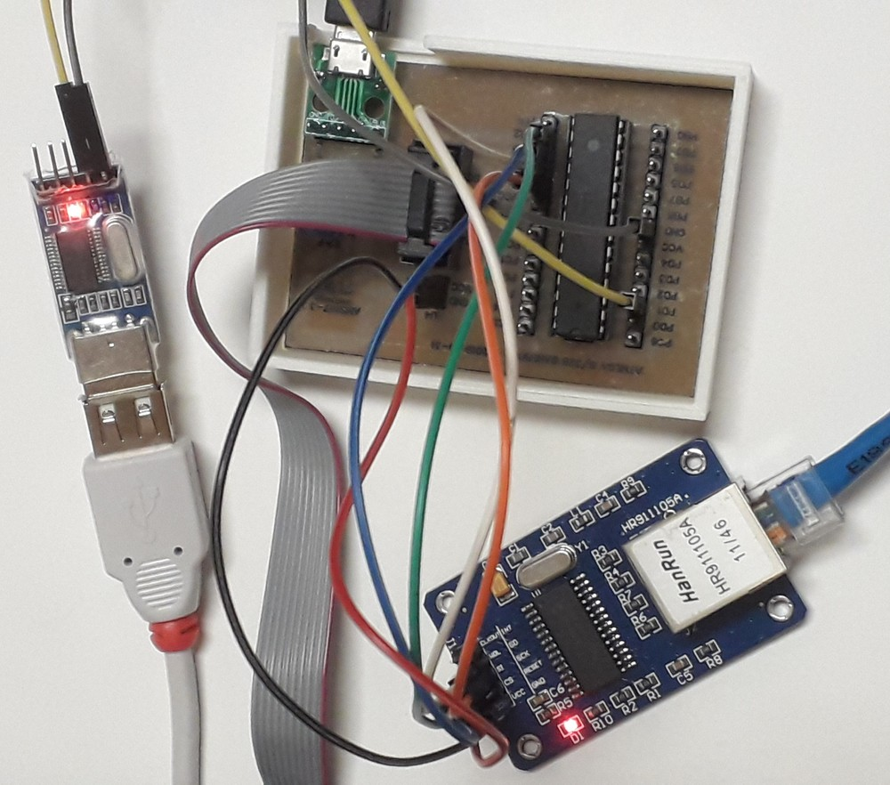

# iot-atmega328p-enc28j60

minimal setup to debug atmega328p with enc28j60



## prerequisites

- software
  - install [vscode arduino](https://github.com/devel0/knowledge/blob/master/electronics/vscode-arduino.md)
  - install [UIPEthernet](https://github.com/UIPEthernet/UIPEthernet)
- hardware
  - [atmega bare](https://github.com/devel0/iot-atmega-bare)
  - [enc28j60](https://www.microchip.com/wwwproducts/en/en022889) module

## config

- tune your network config MACADDRESS and MYIPADDR, MYIPMASK, MYDNS, MYGW if want static initialization
- set UIP_CONF_UDP=0 in UIPEthernet/utility/uipethernet-conf.h library to save up to 5k flash

## sketch size

- serial debug included
- static ip

```
Sketch uses 17346 bytes (52%) of program storage space. Maximum is 32768 bytes.
Global variables use 1100 bytes (53%) of dynamic memory, leaving 948 bytes for local variables. Maximum is 2048 bytes.
```

### wirings

schematics [here](https://easyeda.com/editor#id=|7506cd41b26244d4b4f3a225eba49999) just skip sd card and power enc28j60 from 3v3 setting JP2 to link VCC-3V3

## usage

```
telnet 10.10.2.5 1000
hi
```

- check serial `ctrl+shift+p arduino open serial`

```
received message : hi
```
